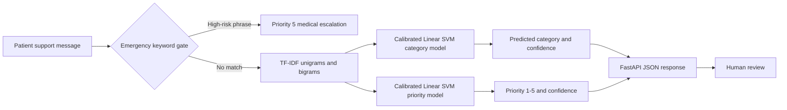

# DiaCare NLP Triage System

[](https://github.com/Tansari2004/diacare-nlp/actions/workflows/ci.yml)
[](https://www.python.org/downloads/)
[](LICENSE)

A machine-learning service that classifies patient-support messages by support category and urgency. It combines calibrated TF-IDF/Linear SVM models with a deterministic emergency-keyword gate and exposes predictions through FastAPI.

> **Portfolio project, not a medical device.** The dataset contains 630 synthetic, domain-aligned messages—no patient records or personal health information. Predictions are decision-support signals and require human review.

## Results

All results use a fixed random seed (`42`), a stratified 20% holdout set (126 messages), and five-fold cross-validation on the remaining training pool.

| Model | Holdout accuracy | Holdout macro F1 | Five-fold CV macro F1 |
| --- | ---: | ---: | ---: |
| Support category | **92.9%** | **0.927** | **0.934 ± 0.033** |
| Priority (1–5) | **80.2%** | **0.808** | **0.816 ± 0.022** |

### Category performance

| Class | Precision | Recall | F1 | Support |
| --- | ---: | ---: | ---: | ---: |
| Appointment | 0.889 | 0.960 | 0.923 | 25 |
| Billing | 0.923 | 0.960 | 0.941 | 25 |
| Medical | 0.962 | 1.000 | 0.980 | 25 |
| Other | 0.923 | 0.923 | 0.923 | 26 |
| Tech bug | 0.952 | 0.800 | 0.870 | 25 |

Category confusion matrix (rows = actual, columns = predicted; class order: appointment, billing, medical, other, tech_bug):

```text
[[24, 0,  0,  1,  0],
 [0,  24, 0,  1,  0],
 [0,  0,  25, 0,  0],
 [0,  0,  1,  24, 1],
 [3,  2,  0,  0,  20]]
```

### Priority performance

| Priority | Precision | Recall | F1 | Support |
| --- | ---: | ---: | ---: | ---: |
| 1 | 0.941 | 0.800 | 0.865 | 20 |
| 2 | 0.783 | 0.818 | 0.800 | 44 |
| 3 | 0.744 | 0.806 | 0.773 | 36 |
| 4 | 0.875 | 0.737 | 0.800 | 19 |
| 5 | 0.750 | 0.857 | 0.800 | 7 |

Priority confusion matrix (rows = actual, columns = predicted; class order: 1, 2, 3, 4, 5):

```text
[[16, 4,  0,  0, 0],
 [1,  36, 7,  0, 0],
 [0,  6,  29, 1, 0],
 [0,  0,  3,  14, 2],
 [0,  0,  0,  1, 6]]
```

Machine-readable results are stored in [`results/metrics.json`](results/metrics.json).

## Architecture



## API example

Start the service and submit a message:

```bash
curl -X POST http://localhost:8000/triage \
  -H "Content-Type: application/json" \
  -d '{"text":"I was charged twice for my subscription."}'
```

Example response:

```json
{
  "input": "I was charged twice for my subscription.",
  "priority": 3,
  "category": "billing",
  "confidence": 0.977,
  "gate_triggered": false,
  "reason_phrases": ["charged", "subscription", "charged twice"],
  "reason": "Top weighted TF-IDF terms for the predicted class (linear model explainability)."
}
```

High-risk phrases bypass the model and trigger a deterministic escalation:

```json
{
  "input": "I have chest pain and feel faint.",
  "priority": 5,
  "category": "medical",
  "confidence": 0.99,
  "gate_triggered": true,
  "reason_phrases": ["chest pain", "faint"],
  "reason": "High-risk symptom keywords detected. Escalate immediately."
}
```

## Run locally

Requirements: Python 3.11+

```bash
git clone https://github.com/Tansari2004/diacare-nlp.git
cd diacare-nlp
python -m venv .venv
source .venv/bin/activate  # Windows: .venv\Scripts\activate
python -m pip install --upgrade pip
pip install -r requirements.txt
```

Train and evaluate both models:

```bash
python train.py
```

This recreates the model artifacts in `models/` and writes the evaluation summary to `results/metrics.json`.

Run the API:

```bash
uvicorn triage_api:app --reload
```

Open `http://127.0.0.1:8000/docs` for the interactive OpenAPI interface.

Run the test suite:

```bash
pytest -q
```

## Docker

```bash
docker build -t diacare-nlp .
docker run --rm -p 8000:8000 diacare-nlp
```

Verify the deployment:

```bash
curl http://localhost:8000/health
```

## Repository structure

```text
data/                  Synthetic dataset and dataset card
models/                Trained scikit-learn pipelines
results/               Reproducible evaluation metrics
tests/                 API and safety-gate tests
train.py               Training, evaluation and artifact generation
triage_api.py          FastAPI inference service
EXPERIMENT_CONFIG.md   Model and evaluation configuration
```

## Limitations and safety

- The dataset is synthetic and balanced by design, so these results do not establish real-world clinical performance.
- The priority model has fewer priority-5 examples than other classes.
- The keyword gate covers a small set of high-risk phrases and is not a replacement for clinical assessment.
- The system should be validated on representative data and reviewed by qualified professionals before any real-world use.

## License

Released under the [MIT License](LICENSE).
